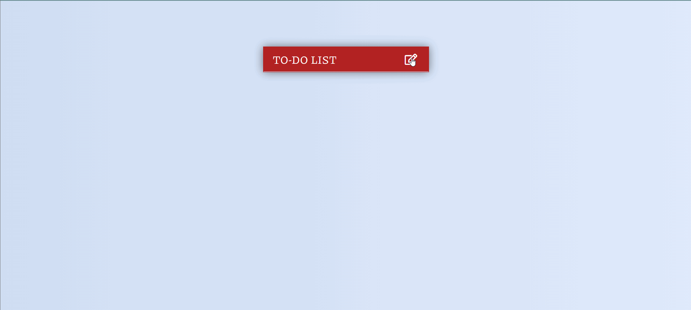

## ToDo List
Todo List is a JQuery based Web app that allows building a todo list and basic todo items management functionality including adding new items, editing and deleting an existing item.

### Tech Stack Used
- HTML
- CSS
- JavaScript
- JQuery

### Available Functionalities 
- [X]  User can view a list of ToDo items
- [X]  User can add or remove ToDo items from the ToDO list.
- [ ]  No Backend Support (Frontend Only Project)

### Demo

Gif - ToDo List

 

Image 1 - Snapshot of Added Task in ToDo List

 

Image 2 - Snapshot of Completed Task in ToDo List

 

Image 3 - Small Screen View

 
